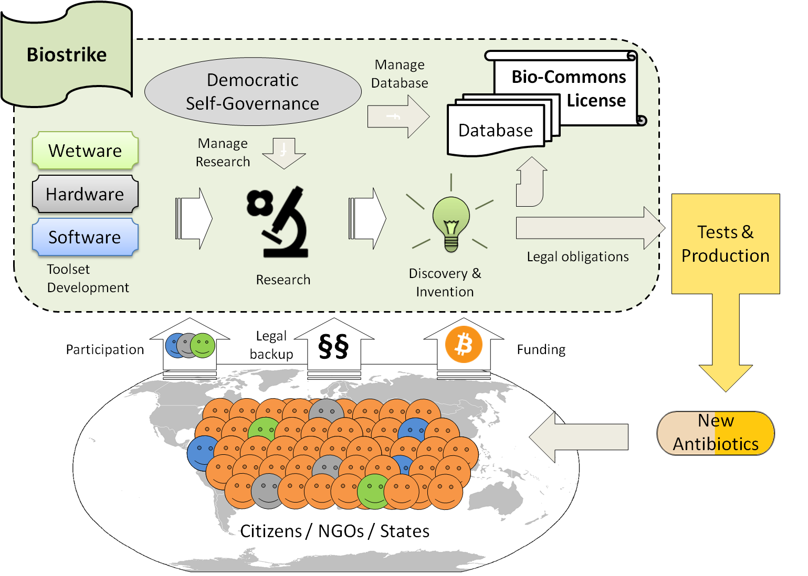

	

	<h1>Bio-Commons</h1>
	

With regards to biotechnology, society relies mainly on patents as means to enable and secure innovations. In recent years, the limits of this intellectual property regime has become increasingly evident. New approaches to biological knowledge and technology, such as the attempts to establish open access and open-source practices to key biotech methods and processes are currently being negotiated. A discussion is initiated that sets out to identify the requirements and conditions for an open and collaborative approach to new licensing models for the Life Sciences. Join us!
	

        
<a class="btn btn-primary btn-lg" role="button"; href="http://bio-commons.github.io/Bio-Commons/BioCommons%20White%20Paper/">Learn more »</a>

	

 

Workflow
==========

